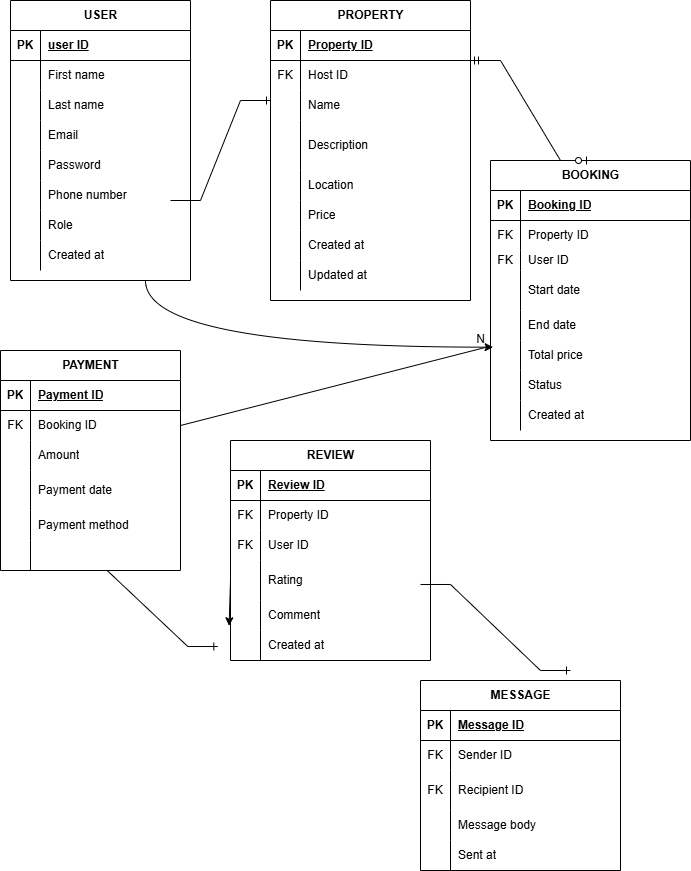

# Entity-Relationship Diagram for Airbnb Database

## Tool Used
I used [Draw.io](https://app.diagrams.net/) to create the ER diagram.

## Identified Entities and Attributes

### User
- id (Primary Key)
- name
- email
- phone

### Property
- id (Primary Key)
- name
- address
- owner_id (Foreign Key to User)

### Booking
- id (Primary Key)
- user_id (Foreign Key to User)
- property_id (Foreign Key to Property)
- start_date
- end_date

### Payment
- id (Primary Key)
- booking_id (Foreign Key to Booking)
- amount
- payment_date

## Relationships
- One **User** can create many **Bookings**
- One **Property** can be booked many times (by different Users)
- Each **Booking** is linked to exactly one **Payment**

## ER Diagram
Here is a visual representation of the ERD:

